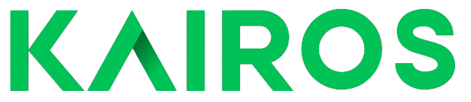

  

<h1 align="center">Kairos - AI Powered Word of the Day</h1>

Kairos is a simple yet powerful web application built with Next.js that enriches your vocabulary effortlessly and helps you expand your linguistic horizons with ease using AI.

## Contributing

Contributions are welcome! Feel free to open issues or submit pull requests for bug fixes, enhancements, or new features.

## License

This project is licensed under the [MIT License](LICENSE).
